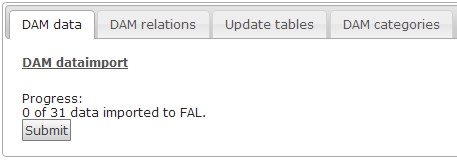
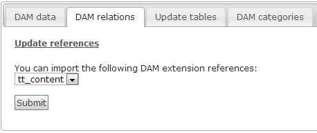
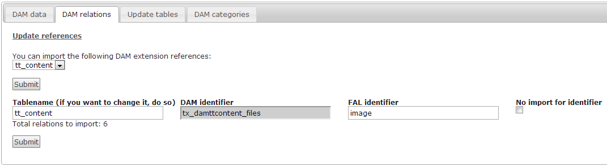
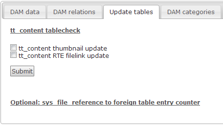
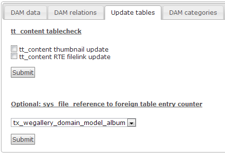
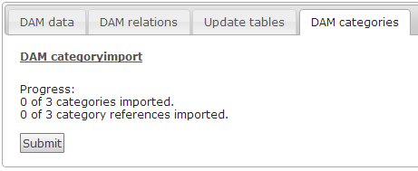

Users Manual
============

By clicking on the “MKDAM2FAL 6.2 dataimport” module, which is placed under the “ADMIN TOOLS” module, you will see the following view:

There are four different tabs: “DAM data”, “DAM relations”, “Update tables” and “DAM categories”. Step 1 is to import all information of the DAM indexed files. Illustration 1 shows you an example of 31 indexed files, which have to be transferred from DAM to FAL. This process will be started by clicking on the “Submit”-button. Dependent on the amount of files, which have to be transferred, the process will take several minutes. If the process has finished, it will be shown in the area “Progress”. In this case you will see the information “31 of 31 data imported to FAL”.

If all DAM data information is transferred, the next step is to use the tab “DAM relations”. With this tab you are able to transfer the relations of the DAM structure into the FAL structure. This is necessary for the standard content elements of TYPO3 and all used extensions, which are using DAM data:

In the tab “DAM relations” you can choose the table/extension which relations have to be transferred from DAM to FAL. After selecting a table/extension you will get a further view, which you can see by illustration 3.

This example shows the scenario for the transfer of the relations from the table of “tt\_content”. For every selected extension, the tables of the extension will be listed. In this step you will see the DAM identifier for every single table and you have to define a new FAL identifier. In the case of “tt\_content” and “pages” the FAL identifier is always given. In other cases you can also use the same identifier by copying the “DAM Identifier” and paste it into the empty field. If it´s necessary, you also have the possibility to define a new table name. If you don´t want to import the relation, just activate the checkbox “No import for identifier”. Start the update for the DAM relations by clicking the 2cnd Submit button. Repeat this scenario for all existing tables/extensions, you want to import.

Step 3 is to update the transferred table for creating thumbnails, replacing the DAM media-tag with the FAL link-tag and to summarize the amount of references for every single object (illustration 5).

The next figure shows the view of the tab “Update tables” for the example with “tt\_content”:

The example shows you the possibility to update the “tt\_content”-table. In this area only the tables will be shown which are transferred before. If you have imported some relations of an extension you will have the following view:

The view “Figure 5” shows the possibility to summarize the amount of references. To start this process you have to select the table of the extension. By clicking on the Submit button, all pictures or files will be summarized and the amount will be written in the selected table.

The last step is to import DAM categories:

In the tab “DAM categories” you will have the possibility to transfer all DAM categories and DAM category references from DAM to FAL.
